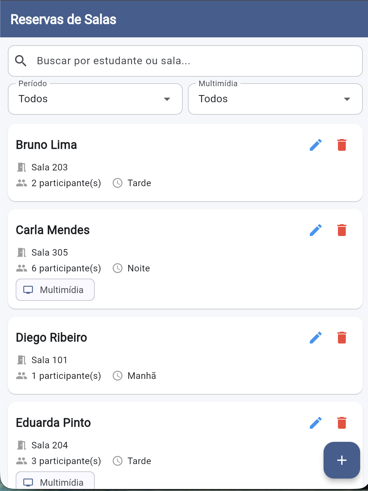
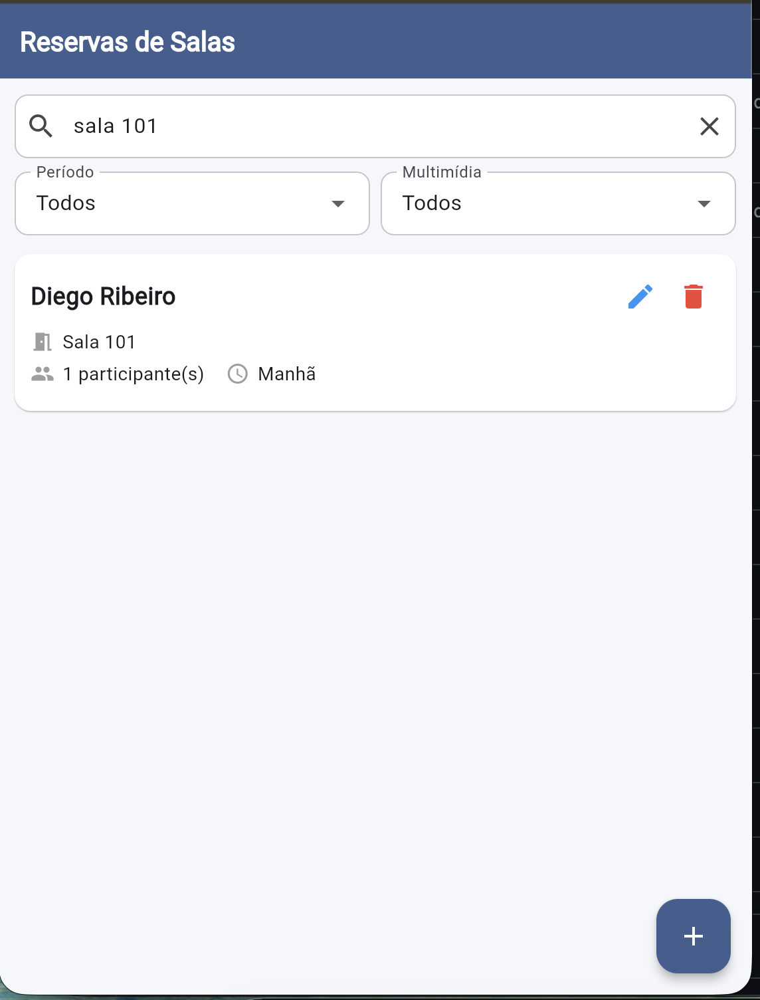
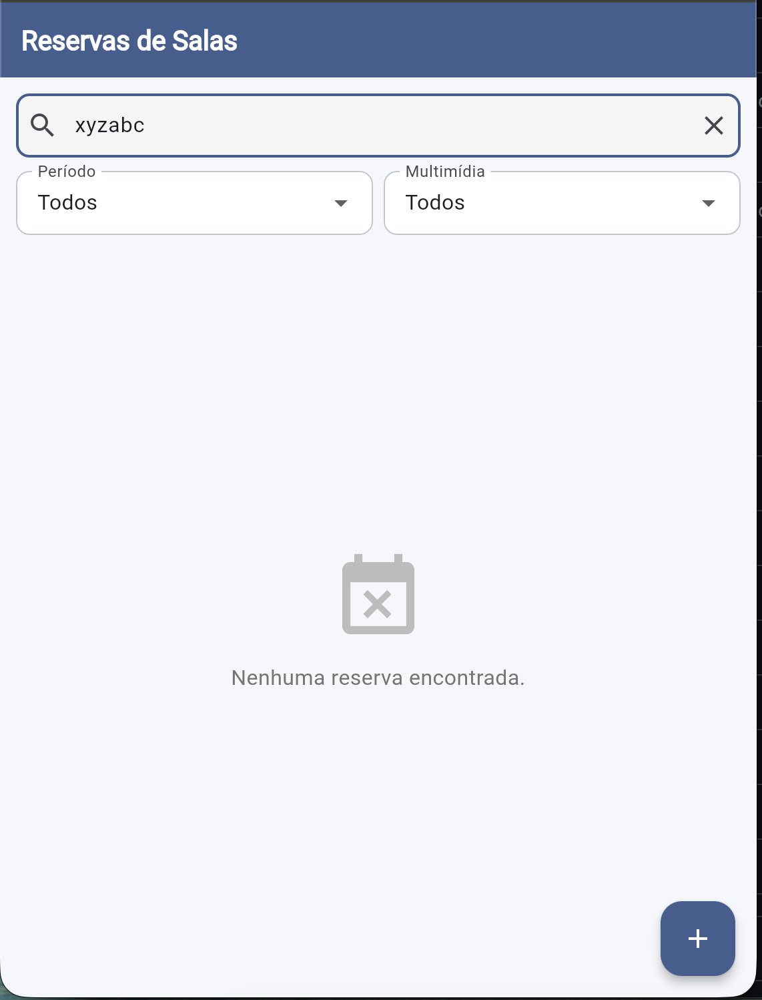
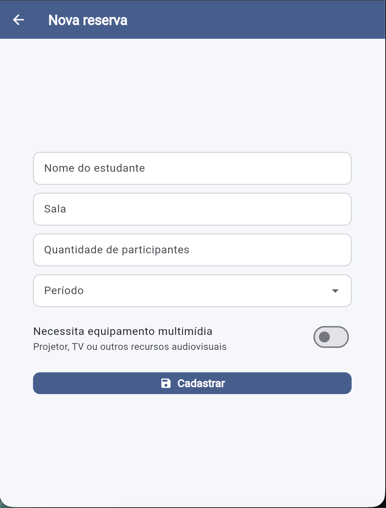
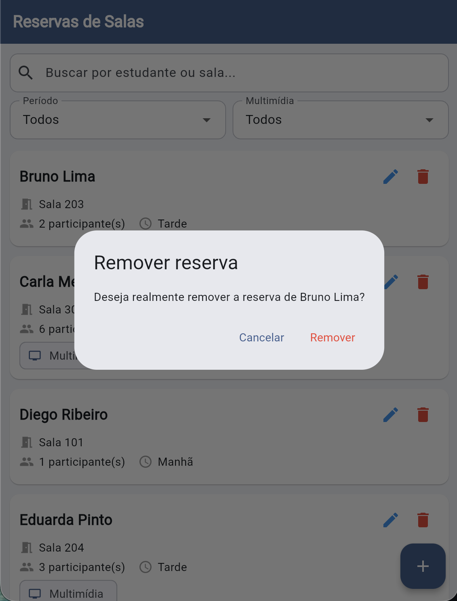

# Sistema de Reservas de Salas de Estudo

Aplicação Flutter para gerenciar reservas de salas de estudo em uma biblioteca
universitária. Permite cadastrar, listar, buscar, filtrar, editar e remover
reservas, com persistência em memória.

> Trabalho individual desenvolvido para a disciplina de Desenvolvimento Mobile.

---

## 📋 Sumário

- [Objetivo](#-objetivo)
- [Problema resolvido](#-problema-resolvido)
- [Funcionalidades](#-funcionalidades)
- [Telas](#-telas)
- [Estrutura de pastas](#-estrutura-de-pastas)
- [Principais widgets utilizados](#-principais-widgets-utilizados)
- [Como executar](#-como-executar)
- [Documentação do uso de IA](#-documentação-do-uso-de-ia)

---

## 🎯 Objetivo

Construir uma aplicação Flutter completa, com CRUD em memória, formulários
validados, busca, filtros e organização modular do projeto, aplicando os
conceitos trabalhados ao longo da disciplina: controle de estado com
`setState`, formulários com `GlobalKey<FormState>`, retorno de dados entre
telas com `Navigator.pop`, e separação de responsabilidades em camadas
(models, mocks, repositories, components, pages, utils).

## 💡 Problema resolvido

Bibliotecas universitárias costumam ter salas de estudo que precisam ser
reservadas pelos estudantes. Sem uma ferramenta organizada, o controle dessas
reservas é feito em papel ou planilhas, dificultando consultar disponibilidade,
identificar reservas por período ou saber rapidamente quais grupos precisam
de equipamento multimídia.

Esta aplicação resolve isso oferecendo uma interface simples para:

- Cadastrar e visualizar todas as reservas em um único lugar.
- Buscar uma reserva específica por nome do estudante ou pela sala.
- Filtrar reservas por período (manhã, tarde, noite) e por necessidade de
  equipamento multimídia.
- Editar e remover reservas com segurança (com confirmação antes de excluir).

## ⚙️ Funcionalidades

- **Listagem** de todas as reservas com `ListView.builder`.
- **Cadastro** de novas reservas com formulário validado.
- **Edição** de reservas existentes reutilizando o mesmo formulário.
- **Remoção** com diálogo de confirmação.
- **Busca textual** por nome do estudante ou sala (case-insensitive).
- **Dois filtros** combinados: período e equipamento multimídia.
- **Estado vazio** exibido quando nenhuma reserva corresponde aos critérios.
- **Feedback visual** com `SnackBar` após cadastro, edição e remoção.
- **Validações**: campos obrigatórios e campo numérico (1 a 20 participantes).
- **Tema visual** consistente em paleta azul, centralizado em `ThemeData`.

## 🖼️ Telas

### Listagem
Tela principal com a lista de reservas, campo de busca e dois filtros.



### Busca
A busca filtra por nome do estudante ou pela sala em tempo real.



### Estado vazio
Quando nenhum resultado corresponde aos critérios de busca e filtros,
um estado vazio é exibido.



### Formulário
Mesmo formulário usado para cadastro e edição, com validação dos campos
obrigatórios e do campo numérico de participantes.



### Confirmação de remoção
Antes de excluir uma reserva, um diálogo de confirmação é exibido.



## 🗂️ Estrutura de pastas

```
lib/
├── components/                 # Widgets reutilizáveis
│   ├── estado_vazio.dart       # Widget para listas vazias / sem resultado
│   └── reserva_card.dart       # Card visual de uma reserva na listagem
├── mocks/
│   └── reservas_mock.dart      # Lista inicial de reservas simuladas
├── models/
│   └── reserva.dart            # Entidade principal (Reserva)
├── pages/
│   ├── formulario_reserva_page.dart   # Tela de cadastro/edição
│   └── lista_reservas_page.dart       # Tela de listagem
├── repositories/
│   └── reserva_repository.dart # CRUD em memória (singleton)
├── utils/
│   └── periodo.dart            # Enum dos períodos da reserva
└── main.dart                   # Ponto de entrada e tema global

docs/
├── ai/                         # Documentação do uso de IA (ver seção abaixo)
└── screenshots/                # Capturas de tela usadas neste README
```

## 🧩 Principais widgets utilizados

| Widget | Onde é usado | Propósito |
|---|---|---|
| `Scaffold` | Todas as telas | Estrutura base com AppBar e body |
| `ListView.builder` | Listagem | Renderizar a lista de reservas eficientemente |
| `TextField` | Listagem | Campo de busca textual |
| `Form` + `GlobalKey<FormState>` | Formulário | Agrupar e validar todos os campos juntos |
| `TextFormField` + `TextEditingController` | Formulário | Campos de texto com controle de valor e validação |
| `DropdownButtonFormField` | Listagem (2x) e Formulário | Filtros e seleção de período |
| `SwitchListTile` | Formulário | Indicar necessidade de equipamento multimídia |
| `AlertDialog` + `showDialog` | Listagem | Confirmação antes de remover uma reserva |
| `SnackBar` + `ScaffoldMessenger` | Listagem | Feedback visual após operações |
| `FloatingActionButton` | Listagem | Ação principal de adicionar nova reserva |
| `Card` | Componente `ReservaCard` | Visual de cada item da lista |
| `ConstrainedBox` + `Center` | Listagem e Formulário | Limitar largura em telas largas (web/desktop) |
| `SingleChildScrollView` | Formulário | Permitir rolagem quando o teclado abre |

## ▶️ Como executar

### Pré-requisitos
- Flutter SDK instalado (versão 3.33 ou superior recomendada)
- Dart SDK (vem junto com o Flutter)
- Um emulador Android/iOS ou Chrome para execução web

### Passos

```bash
# 1. Clone o repositório
git clone https://github.com/alanlinoreis/reserva_salas_estudo.git

# 2. Acesse a pasta do projeto
cd reserva_salas_estudo

# 3. Instale as dependências
flutter pub get

# 4. Execute a aplicação
flutter run
```

Para rodar diretamente no navegador:

```bash
flutter run -d chrome
```

## 🤖 Documentação do uso de IA

Todo o desenvolvimento foi acompanhado pelo Claude (Anthropic), com cada
etapa documentada na pasta [`docs/ai/`](./docs/ai/). Lá você encontra:

- **Prompts** enviados à IA em cada etapa do projeto.
- **Resumos** das respostas obtidas.
- **Decisões** tomadas a partir dessas respostas (o que foi aceito,
  adaptado ou descartado).
- **Relatório final de aprendizado**, sintetizando o que foi aprendido
  ao longo do projeto.

O índice completo está em [`docs/ai/README.md`](./docs/ai/README.md).

---

**Autor:** Alan Lino dos Reis  
**Disciplina:** Desenvolvimento De Aplicativos Para Dispositivos Móveis 
**Repositório:** [github.com/alanlinoreis/reserva_salas_estudo](https://github.com/alanlinoreis/reserva_salas_estudo)